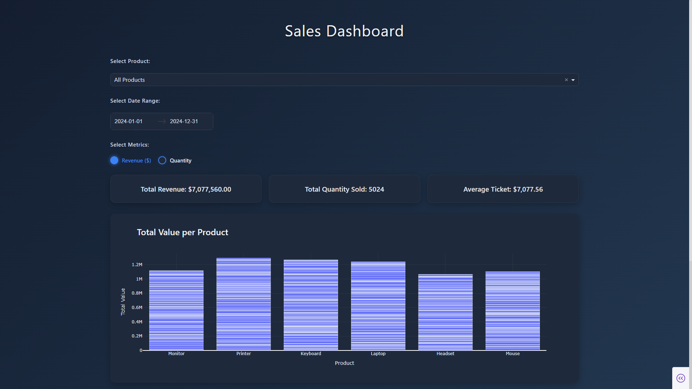
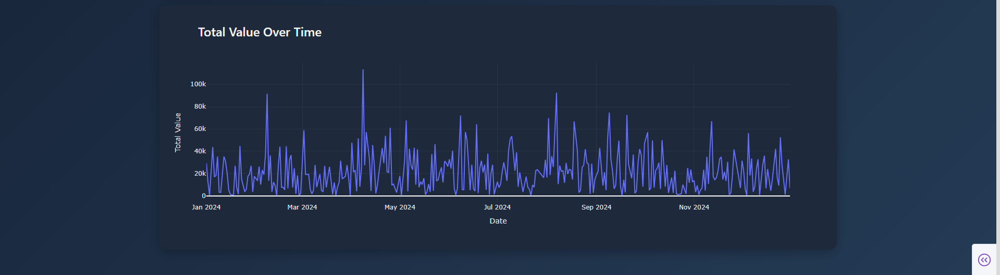

# Sales Dashboard  

## Overview  
This project is an **interactive Sales Dashboard** built with:  
- **Dash (Plotly Dash)** for the web application framework  
- **Plotly Express** for data visualization  
- **Pandas** for data processing and manipulation  
- **CSS** for a fully customized dark theme  

The dashboard allows business users to:  
- Explore sales performance by product and date range  
- Monitor **key performance indicators (KPIs)** such as:  
  - Total Revenue  
  - Total Quantity Sold  
  - Average Ticket (average transaction value)  
- Visualize metrics through dynamic **bar charts** and **line charts**  

It is designed with a **dark modern UI** and optimized for both desktop and mobile displays.  

---

## Preview





---

## Features  
- ◼ **Filter by Product:** Select specific products or view overall sales  
- ◼ **Filter by Date Range:** Interactive calendar to select time periods  
- ◼ **Switch Metrics:** Toggle between *Revenue ($)* and *Quantity*  
- ◼ **KPI Cards:** Auto-updating summary indicators  
- ◼ **Responsive Layout:** Adapts to tablets and smaller screens  

---

## Project Structure  
```
├── app.py         # Main Dash application
├── sales.csv      # Sales dataset (input data)
├── requirements.txt  # Project dependencies
├── assets/
│   └── custom.css # Custom dark mode styling for the dashboard
└── README.md      # Project documentation (this file)
```

> Dash automatically loads stylesheets stored in the `assets/` directory.  

---

## Installation  

### 1. Clone the repository  
```bash
git clone https://github.com/ruan-ds/sales-dashboard.git
cd sales-dashboard
```

### 2. Create and activate a virtual environment (recommended)  
```bash
python -m venv venv
source venv/bin/activate   # Linux / MacOS
venv\Scripts\activate      # Windows
```

### 3. Install dependencies  
```bash
pip install -r requirements.txt
```

---

## Requirements  

The project requires the following libraries (already listed in `requirements.txt`):  
```
pandas==2.3.2
plotly==6.3.0
dash==3.2.0
```

---

## Usage  

1. Place your `sales.csv` file in the project root.  
   - Required columns:  
     - `Date` (transaction date)  
     - `Product` (product name)  
     - `Quantity` (quantity sold)  
     - `Total Value` (total revenue per transaction)  

2. Run the dashboard:  
```bash
python app.py
```

3. Open the application in a browser:  
```
http://127.0.0.1:8050/
```

---

## Customization  

- **Styling**: Modify `assets/custom.css` for layout, theme, or branding changes  
- **Data**: Adapt `sales.csv` to your dataset with compatible column names  
- **Metrics**: Add or replace KPIs in `app.py` inside the callback logic